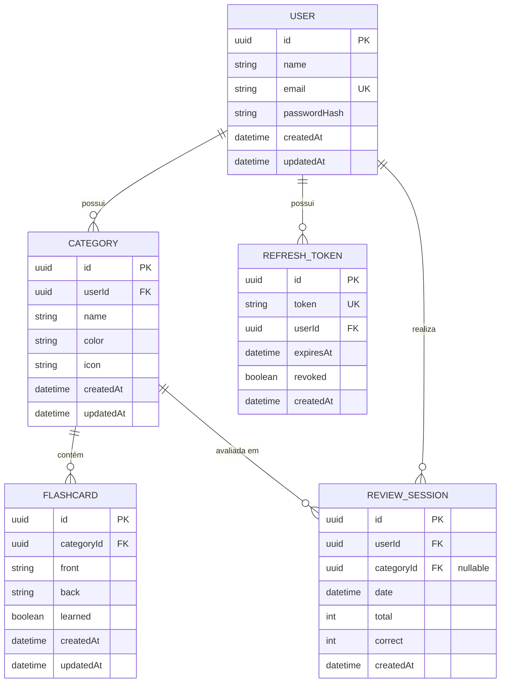

# FlashStudy — Modelo de Dados

## 1. Diagrama Entidade-Relacionamento



---

## 2. Descrição das Entidades

### 2.1 User

Representa um usuário registrado no sistema.

| Campo | Tipo | Restrições | Descrição |
|-------|------|-----------|-----------|
| `id` | UUID | PK, auto-generated | Identificador único |
| `name` | VARCHAR(100) | NOT NULL | Nome do usuário |
| `email` | VARCHAR(255) | NOT NULL, UNIQUE | Email para login |
| `passwordHash` | VARCHAR(255) | NOT NULL | Hash bcrypt da senha |
| `createdAt` | TIMESTAMP | NOT NULL, DEFAULT NOW() | Data de criação |
| `updatedAt` | TIMESTAMP | NOT NULL, auto-updated | Data da última atualização |

### 2.2 RefreshToken

Armazena refresh tokens válidos para renovação de access tokens.

| Campo | Tipo | Restrições | Descrição |
|-------|------|-----------|-----------|
| `id` | UUID | PK, auto-generated | Identificador único |
| `token` | VARCHAR(500) | NOT NULL, UNIQUE | O JWT refresh token |
| `userId` | UUID | FK → User.id, NOT NULL | Proprietário do token |
| `expiresAt` | TIMESTAMP | NOT NULL | Validade do token |
| `revoked` | BOOLEAN | NOT NULL, DEFAULT FALSE | Se foi revogado (logout) |
| `createdAt` | TIMESTAMP | NOT NULL, DEFAULT NOW() | Data de criação |

### 2.3 Category

Representa uma categoria/deck de flashcards, pertencente a um usuário.

| Campo | Tipo | Restrições | Descrição |
|-------|------|-----------|-----------|
| `id` | UUID | PK, auto-generated | Identificador único |
| `userId` | UUID | FK → User.id, NOT NULL | Proprietário da categoria |
| `name` | VARCHAR(100) | NOT NULL | Nome da categoria |
| `color` | VARCHAR(7) | NOT NULL | Cor hex (#2563EB) |
| `icon` | VARCHAR(50) | NOT NULL, DEFAULT 'book-outline' | Nome do ícone (Ionicons) |
| `createdAt` | TIMESTAMP | NOT NULL, DEFAULT NOW() | Data de criação |
| `updatedAt` | TIMESTAMP | NOT NULL, auto-updated | Data da última atualização |

> **Constraint:** UNIQUE(userId, name) — um usuário não pode ter duas categorias com o mesmo nome.

### 2.4 Flashcard

Representa um flashcard individual dentro de uma categoria.

| Campo | Tipo | Restrições | Descrição |
|-------|------|-----------|-----------|
| `id` | UUID | PK, auto-generated | Identificador único |
| `categoryId` | UUID | FK → Category.id, NOT NULL | Categoria à qual pertence |
| `front` | TEXT | NOT NULL | Texto da frente (pergunta) |
| `back` | TEXT | NOT NULL | Texto do verso (resposta) |
| `learned` | BOOLEAN | NOT NULL, DEFAULT FALSE | Se foi marcado como aprendido |
| `createdAt` | TIMESTAMP | NOT NULL, DEFAULT NOW() | Data de criação |
| `updatedAt` | TIMESTAMP | NOT NULL, auto-updated | Data da última atualização |

### 2.5 ReviewSession

Registra o resultado de uma sessão de revisão.

| Campo | Tipo | Restrições | Descrição |
|-------|------|-----------|-----------|
| `id` | UUID | PK, auto-generated | Identificador único |
| `userId` | UUID | FK → User.id, NOT NULL | Quem realizou a sessão |
| `categoryId` | UUID | FK → Category.id, NULLABLE | Categoria revisada (null = todas) |
| `date` | TIMESTAMP | NOT NULL | Data/hora da sessão |
| `total` | INTEGER | NOT NULL | Total de cards na sessão |
| `correct` | INTEGER | NOT NULL | Cards marcados como aprendidos |
| `createdAt` | TIMESTAMP | NOT NULL, DEFAULT NOW() | Data de criação |

---

## 3. Schema Prisma

```prisma
// prisma/schema.prisma

generator client {
  provider = "prisma-client-js"
}

datasource db {
  provider = "postgresql"
  url      = env("DATABASE_URL")
}

model User {
  id           String   @id @default(dbgenerated("gen_random_uuid()")) @db.Uuid
  name         String   @db.VarChar(100)
  email        String   @unique @db.VarChar(255)
  passwordHash String   @map("password_hash") @db.VarChar(255)
  createdAt    DateTime @default(now()) @map("created_at")
  updatedAt    DateTime @updatedAt @map("updated_at")

  categories    Category[]
  refreshTokens RefreshToken[]
  reviewSessions ReviewSession[]

  @@map("users")
}

model RefreshToken {
  id        String   @id @default(dbgenerated("gen_random_uuid()")) @db.Uuid
  token     String   @unique @db.VarChar(500)
  userId    String   @map("user_id") @db.Uuid
  expiresAt DateTime @map("expires_at")
  revoked   Boolean  @default(false)
  createdAt DateTime @default(now()) @map("created_at")

  user User @relation(fields: [userId], references: [id], onDelete: Cascade)

  @@index([userId])
  @@index([token])
  @@map("refresh_tokens")
}

model Category {
  id        String   @id @default(dbgenerated("gen_random_uuid()")) @db.Uuid
  userId    String   @map("user_id") @db.Uuid
  name      String   @db.VarChar(100)
  color     String   @db.VarChar(7)
  icon      String   @default("book-outline") @db.VarChar(50)
  createdAt DateTime @default(now()) @map("created_at")
  updatedAt DateTime @updatedAt @map("updated_at")

  user       User        @relation(fields: [userId], references: [id], onDelete: Cascade)
  flashcards Flashcard[]
  reviewSessions ReviewSession[]

  @@unique([userId, name])
  @@index([userId])
  @@map("categories")
}

model Flashcard {
  id         String   @id @default(dbgenerated("gen_random_uuid()")) @db.Uuid
  categoryId String   @map("category_id") @db.Uuid
  front      String   @db.Text
  back       String   @db.Text
  learned    Boolean  @default(false)
  createdAt  DateTime @default(now()) @map("created_at")
  updatedAt  DateTime @updatedAt @map("updated_at")

  category Category @relation(fields: [categoryId], references: [id], onDelete: Cascade)

  @@index([categoryId])
  @@index([categoryId, learned])
  @@map("flashcards")
}

model ReviewSession {
  id         String   @id @default(dbgenerated("gen_random_uuid()")) @db.Uuid
  userId     String   @map("user_id") @db.Uuid
  categoryId String?  @map("category_id") @db.Uuid
  date       DateTime
  total      Int
  correct    Int
  createdAt  DateTime @default(now()) @map("created_at")

  user     User      @relation(fields: [userId], references: [id], onDelete: Cascade)
  category Category? @relation(fields: [categoryId], references: [id], onDelete: SetNull)

  @@index([userId])
  @@index([userId, categoryId])
  @@map("review_sessions")
}
```

---

## 4. DDL SQL equivalente

> Gerado como referência. Na prática, o Prisma gerencia as migrations.

```sql
-- Extensão para UUID (PostgreSQL 13+ já possui gen_random_uuid())
-- CREATE EXTENSION IF NOT EXISTS "pgcrypto";

-- ============================================
-- USERS
-- ============================================
CREATE TABLE users (
  id            UUID PRIMARY KEY DEFAULT gen_random_uuid(),
  name          VARCHAR(100)  NOT NULL,
  email         VARCHAR(255)  NOT NULL UNIQUE,
  password_hash VARCHAR(255)  NOT NULL,
  created_at    TIMESTAMPTZ   NOT NULL DEFAULT NOW(),
  updated_at    TIMESTAMPTZ   NOT NULL DEFAULT NOW()
);

-- ============================================
-- REFRESH TOKENS
-- ============================================
CREATE TABLE refresh_tokens (
  id         UUID PRIMARY KEY DEFAULT gen_random_uuid(),
  token      VARCHAR(500)  NOT NULL UNIQUE,
  user_id    UUID          NOT NULL REFERENCES users(id) ON DELETE CASCADE,
  expires_at TIMESTAMPTZ   NOT NULL,
  revoked    BOOLEAN       NOT NULL DEFAULT FALSE,
  created_at TIMESTAMPTZ   NOT NULL DEFAULT NOW()
);

CREATE INDEX idx_refresh_tokens_user_id ON refresh_tokens(user_id);
CREATE INDEX idx_refresh_tokens_token   ON refresh_tokens(token);

-- ============================================
-- CATEGORIES
-- ============================================
CREATE TABLE categories (
  id         UUID PRIMARY KEY DEFAULT gen_random_uuid(),
  user_id    UUID         NOT NULL REFERENCES users(id) ON DELETE CASCADE,
  name       VARCHAR(100) NOT NULL,
  color      VARCHAR(7)   NOT NULL,
  icon       VARCHAR(50)  NOT NULL DEFAULT 'book-outline',
  created_at TIMESTAMPTZ  NOT NULL DEFAULT NOW(),
  updated_at TIMESTAMPTZ  NOT NULL DEFAULT NOW(),

  UNIQUE(user_id, name)
);

CREATE INDEX idx_categories_user_id ON categories(user_id);

-- ============================================
-- FLASHCARDS
-- ============================================
CREATE TABLE flashcards (
  id          UUID PRIMARY KEY DEFAULT gen_random_uuid(),
  category_id UUID    NOT NULL REFERENCES categories(id) ON DELETE CASCADE,
  front       TEXT    NOT NULL,
  back        TEXT    NOT NULL,
  learned     BOOLEAN NOT NULL DEFAULT FALSE,
  created_at  TIMESTAMPTZ NOT NULL DEFAULT NOW(),
  updated_at  TIMESTAMPTZ NOT NULL DEFAULT NOW()
);

CREATE INDEX idx_flashcards_category_id          ON flashcards(category_id);
CREATE INDEX idx_flashcards_category_id_learned  ON flashcards(category_id, learned);

-- ============================================
-- REVIEW SESSIONS
-- ============================================
CREATE TABLE review_sessions (
  id          UUID PRIMARY KEY DEFAULT gen_random_uuid(),
  user_id     UUID         NOT NULL REFERENCES users(id) ON DELETE CASCADE,
  category_id UUID         REFERENCES categories(id) ON DELETE SET NULL,
  date        TIMESTAMPTZ  NOT NULL,
  total       INTEGER      NOT NULL,
  correct     INTEGER      NOT NULL,
  created_at  TIMESTAMPTZ  NOT NULL DEFAULT NOW()
);

CREATE INDEX idx_review_sessions_user_id              ON review_sessions(user_id);
CREATE INDEX idx_review_sessions_user_id_category_id  ON review_sessions(user_id, category_id);
```

---

## 5. Decisões de Design do Modelo

| Decisão | Justificativa |
|---------|---------------|
| **UUID como PK** | Evita exposição de IDs sequenciais, facilita merge de dados em cenários multi-tenant |
| **`userId` em Category** | Cada categoria pertence a um único usuário — isolamento total de dados |
| **`categoryId` nullable em ReviewSession** | Revisão geral (todos os cards) gera sessão sem categoria específica |
| **ON DELETE CASCADE** em flashcards e categories | Ao deletar uma categoria, todos os cards são removidos automaticamente |
| **ON DELETE SET NULL** em review_sessions.category_id | Se uma categoria for deletada, as sessões de revisão históricas são preservadas |
| **UNIQUE(userId, name) em Category** | Evita categorias duplicadas para o mesmo usuário |
| **Índice composto (categoryId, learned)** | Otimiza a query de filtragem de cards pendentes/aprendidos |
| **Campo `learned` no Flashcard** | Reflete exatamente a lógica do frontend (`MARK_LEARNED`, `SET_CARD_LEARNED`) |
| **`passwordHash` em vez de `password`** | Senha nunca armazenada em texto plano; bcrypt com salt rounds = 12 |
| **RefreshToken em tabela separada** | Permite revogação individual (logout), limpeza de tokens expirados, e suporte a múltiplos dispositivos |
| **snake_case no banco, camelCase no Prisma** | Convenção PostgreSQL no DB, convenção JS/TS no código — Prisma faz o mapeamento via `@map` |
